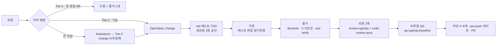

# cgamja

> 프론트엔드 개발을 "제대로" 하게 만드는 Claude Code 절차 플러그인 — 스펙 → 테스트 → 증거 → 리뷰를 건너뛰지 못하게 한다.

  

코드를 *대신* 짜는 도구가 아니다. 에이전트가 코드를 짤 때 정해진 기준(디자인 원천, 접근성, 플랫폼 적합성, API 계약, 테스트 무결성)을 **매 작업에 기계적으로 강제**하는 절차 스킬 모음이다. 규칙은 산문이 아니라 린트·훅·테스트로 판정한다 — "주의 깊게 하라"는 지시는 규칙으로 치지 않는다.

대상 프로젝트는 주어지는 것이다. greenfield든 수년 된 brownfield든, 어떤 프레임워크·러너·린터를 쓰든 플러그인이 프로젝트를 **읽고 맞춘다**. 스택을 정하거나 바꾸라고 하지 않는다. ([철학 전문](docs/philosophy.md))

## 특징

- **스펙이 척추** — 행동은 OpenSpec `#### Scenario`(WHEN/THEN)로 먼저 적고, 테스트·스크린샷과 1:1로 대조한다. 계획 문서가 두 군데 생기지 않는다.
- **테스트는 게이트** — 실패하는 테스트를 먼저 쓰고 사람이 승인(세션당 1회)한 뒤 구현한다. 구현 턴에 테스트 파일은 읽기전용, 초록을 만들기 위한 assertion 수정은 거부된다.
- **증거 없이 완료 없음** — "됐습니다"가 아니라 `verify` 출력·테스트 결과·뷰포트별 스크린샷·axe 결과가 완료다. 촬영 수단이 있으면 에이전트가 직접 찍는다.
- **훅이 강제한다** — 보호 파일 쉘 쓰기·훅 우회·테스트 변조·계약 생성물 수동 편집을 PreToolUse 훅이 막고, Stop 훅이 완료 정의(`verify`)를 확인한다. 승인 경로는 권한 프롬프트 하나로 통일(사람이 diff를 보고 승인).
- **리뷰는 렌즈** — 정확성·스펙 완전성·테스트 무결성·접근성·플랫폼·계약·성능의 7개 persona가 새 컨텍스트로 병렬 리뷰하고 한 표로 합친다. 스타일 지적은 없다.
- **스택 불문이 검증된다** — 절차 문서에 프레임워크·도구 이름이 조건으로 나오면 `tests/test_stack_words.sh`가 실패한다. 프로젝트의 사실은 대상 레포의 `.claude/cgamja.json` 선언이 갖는다.
- **비용이 투명하다** — 모든 절차의 실측 비용이 [`reports/`](reports/)에 쌓이고, 작업 시작 시 예상 비용을 먼저 보고한다.

## 설치

skills-directory 플러그인이라 마켓플레이스·install 과정이 없다:

```bash
git clone https://github.com/cgamja/cgamja-plugin.git ~/cgamja-plugin
ln -s ~/cgamja-plugin ~/.claude/skills/cgamja
```

다음 세션부터 `cgamja@skills-dir`로 자동 로드되고, 저장소를 수정하면 바로 반영된다(세션 중 반영은 `/reload-plugins`). 심링크라 제자리에서 로드된다 — 스킬이 쓰는 `adr/`·`reports/`가 이 저장소에 바로 쌓이고, 훅의 `${CLAUDE_PLUGIN_ROOT}`도 이 경로로 풀린다. 특정 세션만 다른 체크아웃을 쓰려면 `claude --plugin-dir <path>`.

**함께 쓰는 것**: [OpenSpec](https://github.com/Fission-AI/OpenSpec)(스펙·tasks, 대상 프로젝트 devDependency), [compound-engineering](https://github.com/EveryInc/compound-engineering) 플러그인(brainstorm·commit·PR·debug). `bin/openspec` 래퍼가 PATH에 들어가 `/opsx:*` 명령의 bare `openspec` 호출을 프로젝트 의존성 → `pnpm exec` → `npx` 순으로 연결한다.

## 시작하기

```
/cgamja:develop-setup      # 프로젝트당 1회 — 읽고, 대조하고, 없는 강제 수단만 붙인다
/cgamja:develop-fe <작업>   # 이후 모든 코드 변경은 여기로
/cgamja:develop-update     # 플러그인이 바뀌었을 때 — 레포에 복사된 훅·선언을 현재 버전으로
```

## 스킬

| 스킬 | 역할 | 사람 게이트 |
|---|---|---|
| [`develop-setup`](skills/develop-setup/SKILL.md) | 프로젝트를 읽어(스택 불문·brownfield) 철학의 강제 수단을 대조 → 없는 것만 최소 제안 → 프로브로 "진짜 막나" 확인 → `.claude/cgamja.json` 선언 | 질문 ≤5개 묶음 1회 |
| [`develop-update`](skills/develop-update/SKILL.md) | 이미 세팅된 프로젝트를 플러그인 현재 버전으로 — 복사본 4축(훅 내용·훅 등록·선언 슬롯·rules 구조)을 **내용으로** 대조하고 갱신(adr/0033) | 커밋 전 보고 |
| [`develop-fe`](skills/develop-fe/SKILL.md) | 오케스트레이터(v2, adr/0026) — 티어 판정(1/2) → OpenSpec → TDD → 구현 → 증거 → 리뷰 2축 → 비주얼 QA → 커밋/PR. 디자인 플래그 `--only-wf`/`--only-design`/`--wf-and-design` | 질문 1회 + red 승인 1회 |
| [`develop-baby-fe`](skills/develop-baby-fe/SKILL.md) | MVP·프로토타입·데모용 경량 루프 — 절차를 끄고 비용·속도 우선(목표 <$5), API 계약이 걸리면 develop-fe로 에스컬레이션 | 질문 ≤1회 |
| [`test-driven-development`](skills/test-driven-development/SKILL.md) | vendored TDD 스킬(addyosmani, MIT) — 실패 테스트 먼저, 버그는 재현 테스트 먼저(Prove-It) | red 승인(세션당 1회, workflow가 얹음) |
| [`browser-testing-with-devtools`](skills/browser-testing-with-devtools/SKILL.md) | vendored(addyosmani, MIT) — Chrome DevTools MCP로 런타임 검증(콘솔 0·DOM·네트워크·성능) | — |
| [`review-cgamja`](skills/review-cgamja/SKILL.md) | 철학·SPEC(`docs/spec/`) 대조 게이트 — reviewer-cgamja 서브에이전트가 문서 조항 인용 판정, FAIL이면 수정 → 재검사 1회 | — |
| [`qa-cgamja`](skills/qa-cgamja/SKILL.md) | 비주얼 회귀 QA — 동작 플로우 THEN 시점 스냅샷(웹 Playwright / 앱 Maestro), baseline 사람 승인 | baseline 승인 |
| [`retro-fe`](skills/retro-fe/SKILL.md) | 실사용 세션 트랜스크립트를 감사해 마찰(훅 차단·인터럽트·되물음)을 집계하고 개선을 **제안까지만** — 반영은 ADR로 | — |

버그 리뷰 축은 `code-review-opus` 에이전트(`model: opus`, 현재 `cgamja-private`)를 Agent로 띄운다 — 내장 `/code-review`는 fork라 세션 모델을 물려받는다(adr/0037). 에이전트가 없을 때만 `/code-review`로 대신한다. 구 `test-fe`·`review-fe`(렌즈 L1~L7)는 adr/0026으로 폐지 — git 이력에 있다.

### develop-fe 흐름



티어 기준은 작업량이 아니라 **불확실성과 파급 범위**다. 버그는 티어와 별개로 `/ce-debug`로 진입한다.

### 어느 스킬로 시작하나

| | `develop-baby-fe` | `develop-fe` |
|---|---|---|
| 대상 | MVP, 프로토타입, 데모, 해커톤 | 프로덕션 레포, 티켓 기반 작업 |
| 우선순위 | 비용·속도 | 정확성·증거·스펙 유지 |
| 스펙 / 테스트 / 리뷰 | 없음 / 기존 초록 유지 / L1 1회 | OpenSpec / red 게이트 / 리뷰 2축 |
| 실측 비용 | 목표 <$5 | Tier-1 $0.74 · Tier-2(v1 렌즈 체계 실측 $30~45 — v2 2축은 재측정 예정) |

v1에서 Tier-2 비용의 절반 이상이 렌즈 리뷰였다(연구상 리뷰 단계 토큰 59.4%) — v2가 렌즈 7개를 2축(review-cgamja + code-review)으로 줄인 이유다(adr/0026). 렌즈별 실효 기록은 [`reports/lens-ledger.md`](reports/lens-ledger.md).

## 구조

```
skills/            절차 — develop-setup · develop-update · develop-fe(+workflow.md, hooks/, templates/git-hooks/) · develop-baby-fe · review-cgamja · qa-cgamja · test-driven-development(vendored) · browser-testing-with-devtools(vendored) · retro-fe
agents/            reviewer-cgamja(철학 대조) · reviewer-correctness(baby용 L1)
adr/               결정 기록 0001~0026 — 절차를 바꾸려면 ADR 먼저, 문서는 ADR을 참조
reports/           실측 기록 — 시나리오·비용·모델·통과표·결함·렌즈 원장
tests/             훅·preflight·문서 경로·스택 단어의 결정적 회귀 테스트 (LLM 호출 없음)
docs/              philosophy.md(고정점) · positioning.md(지형) · spec/(판정 기준 — 코드 철학 SPEC, cgamja-philosophy 사본) · guides/(작업 지식 — 스택 무관 원칙 + "검증된 구현", 구 references)
licenses/          vendored 스킬 원 라이선스(MIT)
bin/               openspec 래퍼
```

세 층으로 나뉜다([adr/0014](adr/0014-stack-agnostic-three-layers.md)): ① **절차**(`skills/`·`agents/`)는 슬롯 이름으로만 말하고, ② **프로젝트 선언**(대상 레포의 `.claude/cgamja.json`)이 사실을 갖고, ③ **references**가 원칙과 검증된 구현을 나눠 담는다. 스킬 이름의 `-fe`는 프론트엔드 관심사(디자인 원천·접근성·플랫폼·스크린샷 증거)가 절차에 있다는 뜻이지 특정 스택이 아니다.

훅은 두 곳에 있다: 스킬 frontmatter 훅(`skills/develop-fe/hooks/` — 금지 스킬 호출 차단·세팅 누락 경고, 스킬을 부른 세션에만 등록)과 develop-setup이 대상 프로젝트에 심는 훅(`skills/develop-setup/templates/hooks/` — 보호 파일 ask, red 게이트 마커, 계약 생성물 보호, verify-on-stop). 플러그인 전역 훅은 의도적으로 쓰지 않는다([adr/0007](adr/0007-skill-hooks.md), [adr/0017](adr/0017-hook-precision-and-handoff.md), [adr/0018](adr/0018-red-gate-batch-approval.md)).

## 검증

```bash
bash tests/run.sh    # 훅·preflight·문서 경로·스택 단어 회귀 — 수 초, LLM 호출 없음
```

검증은 4층 피라미드([adr/0013](adr/0013-skill-verification-pyramid.md))로 나뉜다: 결정적 회귀(위 명령) → 트리거 검사 → LLM 행동 eval(`claude plugin eval`, 실패 모드가 보인 뒤 3~5개만) → 실사용 스크래치 런(`reports/`). ADR의 "검증" 란은 reports의 실측으로만 채운다.

## 설계 결정

모든 절차 변경은 [ADR](adr/README.md)을 먼저 쓴다. 상태는 `제안`(검증 1~2회) → `채택`(3회 이상 유지) → `대체됨`/`폐기`. 같은 이탈이 2회 반복되면 새 번호로 개정한다. 최근 웨이브(0017~0022)는 실사용 4세션 회고에서 나왔다 — 훅 오탐·승인 피로·커밋 과다·컨텍스트 소진을 각각 결정으로 닫았고, 그 회고 절차 자체를 `retro-fe` 스킬로 만들었다. 이어진 2차 회고(코드 감사 통합)가 0023~0025를 낳았다 — 훅 오탐 재발, 스펙·L1의 검출 사각지대, 증거 캡처 운전 루프 비용.

## 관련 문서

- [철학 — 바뀌지 않는 것](docs/philosophy.md) · [포지셔닝 — 비슷한 도구들과의 지형](docs/positioning.md)
- 앱 화면 수집 스킬(`app-ref-to-figma`)은 앱별 리포트가 쌓여 비공개 저장소 `cgamja-private`에 따로 있다.

## 라이선스

[MIT](LICENSE)
